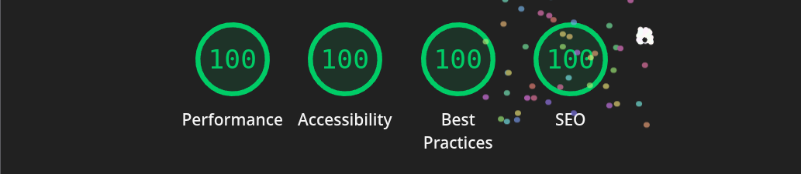

# 🌐 Personal Blog & Wiki Template

A modern, content-first personal website built with [Astro](https://astro.build), designed for technology articles, wikis, projects, and indie web principles. Write in [Obsidian](https://obsidian.md), publish with ease.

## ✨ Features

- 📝 **Multiple Content Collections**: Blog, Wiki, Projects, and standalone pages (About, Now, Uses, Blogroll, Bookmarks, Reading)
- 🌳 **Hierarchical Wiki**: Nested folder structure with automatic tree navigation
- 🎨 **Tailwind CSS v4**: Centralized styling system with custom properties
- 🔍 **Full-text Search**: Powered by [Pagefind](https://pagefind.app/) with keyboard shortcuts (Cmd/Ctrl + K)
- 🌓 **Theme Switching**: Built-in dark/light mode toggle with persistent preference
- 📱 **Fully Responsive**: Mobile-first design
- 🚀 **Mostly Static**: Lightning-fast performance with minimal JavaScript for interactive features
- 🔗 **Indie Web Ready**: Blogroll, bookmarks, and RSS feed support
- 🎵 **Music Integration**: Live Last.fm integration showing current playing track and listening history
- 🔖 **Raindrop.io Integration**: Dynamic bookmarks and reading lists from your Raindrop collections
- ⚡ **Interactive Components**: Svelte 5 components with TanStack Query for real-time data
- ✍️ **Obsidian Integration**: Write content in Obsidian, sync via GitHub Actions (see TODO section)
- 🏷️ **Smart Tagging**: Automatic tag aggregation and filtering
- 📄 **SEO Optimized**: Sitemap, RSS feed, and semantic HTML
- 🎯 **Custom Rehype Plugins**: Automatic external link icons, H1 removal, and relative link conversion

## 🏗️ Architecture

### Content Collections

The site is built around 8 content types, all defined in `src/content.config.ts`:

- **blog**: Technology articles and posts
- **wiki**: Hierarchical knowledge base with nested folder support
- **projects**: Portfolio and project showcases
- **about**: Personal information
- **uses**: Tools and setup
- **now**: Current activities (inspired by [nownownow.com](https://nownownow.com/))
- **blogroll**: Curated list of blogs you follow
- **bookmarks**: Saved links and resources (powered by Raindrop.io)
- **reading**: Reading list (powered by Raindrop.io collection named "reading")

> Note: Both `bookmarks` and `reading` pages are dynamically generated from Raindrop.io collections, not local content files.

### Configuration System

All site behavior is controlled through three main files:

#### `site.json`

Global site metadata (title, description, author, social links, etc.)

```json
{
  "url": "https://ansango.com",
  "name": "ansango",
  "description": "Notas de tecnología y desarrollo web.",
  "image": "/avatar.jpeg",
  "email": "anibalsantosgo@gmail.com",
  "lang": "es",
  "author": "Anibal Santos"
}
```

#### `src/content.config.ts`

Content collection schemas using Zod. Defines frontmatter structure for each collection type with common schemas for SEO, metadata, and publishing status.

#### `src/constants.ts`

Collection metadata, pagination settings, URLs, site structure, and navigation tree. This file exports the `site` object which contains all pages metadata and the navigation hierarchy.

### Content Structure

```
src/content/
├── blog/              # Blog posts
├── wiki/              # Hierarchical wiki
│   ├── ai/
│   │   └── agentes.md
│   └── development/
│       └── web/
├── projects/          # Project showcases
├── about.md           # About page
├── uses.md            # Uses page
├── now.md             # Now page
├── blogroll.md        # Blogroll
└── bookmarks.md       # Bookmarks (now backed by Raindrop collections)
```

## 🚀 Getting Started

### Prerequisites

- Node.js 18+
- npm, pnpm, or bun
- (Optional) Raindrop.io account for bookmarks integration
- (Optional) Last.fm account for music integration

### Installation

```bash
# Clone the repository
git clone https://github.com/yourusername/your-repo.git
cd your-repo

# Install dependencies
npm install

# Copy environment variables
cp .env.sample .env

# Edit .env and add your API keys (optional but recommended):
# - RAINDROP_ACCESS_TOKEN for bookmarks/reading integration
# - PUBLIC_LASTFM_API_KEY for music integration

# Start development server
npm run dev
```

Visit `http://localhost:4321` to see your site.

### Available Commands

```bash
npm run dev          # Start development server
npm run build        # Build for production
npm run preview      # Preview production build
npm run astro        # Run Astro CLI commands
npm run format       # Format code with Prettier
```

Quick checklist:

- Ensure Node.js 18+ is installed
- Copy `.env.sample` to `.env` and fill required tokens (see 'Environment Variables' section)
- Install dependencies with `npm install`
- Run `npm run dev` while developing

## 📝 Content Management

### Frontmatter Format

Each content type has specific frontmatter requirements. Example for a blog post:

```markdown
---
title: "My First Post"
description: "A great introduction to my blog"
date: 2025-10-11
mod: 2025-10-11
published: true
tags: [astro, web-development]
---

Your content here...
```

### Publishing Content

- Set `published: true` in frontmatter to make content visible
- Use `published: false` to keep drafts hidden
- The `mod` field tracks last modification date
- Tags are automatically slugified and aggregated

### Wiki Organization

The wiki supports nested folders for hierarchical content:

```
wiki/
├── development/
│   ├── web/
│   │   └── frameworks.md
│   └── devtools.md
```

Navigation is automatically generated from folder structure.

## 🎨 Styling

### Tailwind CSS v4

The project uses Tailwind CSS v4 with a centralized styling approach:

- Global styles in `src/styles/global.css`
- Component-specific styles in individual style files (`content.css`, `headings.css`, `tables.css`, `theme.css`)
- Theme tokens defined in CSS custom properties
- Dark mode support via class strategy with automatic theme detection and toggle
- Font family: Inter Variable from `@fontsource-variable/inter`

### Layout System

Layouts are modular and composable:

```
src/layout/
├── default.astro           # Base layout wrapper
└── elements/
    ├── head.astro          # SEO and meta tags
    ├── header.astro        # Site header with navigation and search
    ├── footer.astro        # Site footer
    ├── theme.astro         # Theme toggle component
    ├── theme.script.astro  # Theme switching logic
    └── clipboard.script.astro  # Code copy functionality
```

### Component Architecture

Components are organized by atomic design principles:

```
src/components/
├── atoms/              # Basic building blocks (Container, Link, Tag, etc.)
├── molecules/          # Composed components (Pagination, Searcher, Tree-node)
├── organisms/          # Complex sections (Archive, Bookmarks, Reading, Wiki, Music)
├── templates/          # Page templates for collections and entries
├── icons/              # SVG icon components
└── layout/             # Layout wrapper components
```

## 🔌 Integrations

### Astro Integrations

- **@astrojs/sitemap**: Automatic XML sitemap generation
- **astro-pagefind**: Full-text search indexing with zero-config setup
- **@astrojs/svelte**: Svelte 5 integration for interactive components
- **@astrojs/rss**: RSS feed generation for blog posts

### Svelte 5 Components

The project uses Svelte 5 for interactive features:

- **PlayNow**: Real-time Last.fm current track display with auto-refresh
- **PlayNow Mini**: Compact version of the music player
- Uses TanStack Query (Svelte Query) for data fetching and caching

### Rehype Plugins

Custom plugins in `src/lib/rehype.ts`:

- **rehypeRemoveH1**: Removes H1 tags (titles come from frontmatter)
- **elementArrow**: Adds visual arrow icons to external links

### Third-party Rehype Plugins

- **astro-rehype-relative-markdown-links**: Converts relative MD links to proper routes
- **rehype-external-links**: Enhanced external link handling with `target="_blank"` and security attributes

### Raindrop.io Integration

This project integrates with Raindrop.io to power the Bookmarks and Reading sections. These are implemented as dynamic pages that fetch data from your Raindrop collections at build time.

#### Quick Setup

1. Create a Raindrop API access token at: https://raindrop.io/settings/integrations
2. Copy `.env.sample` to `.env` and set your token:

```env
RAINDROP_ACCESS_TOKEN=your_raindrop_access_token_here
```

3. Ensure your environment (local development and deployment) provides the `RAINDROP_ACCESS_TOKEN` environment variable.

#### Implementation Details

- **Services**: Located in `src/lib/raindrop/` with utilities for fetching collections and bookmarks
- **Caching**: Implements in-memory caching to avoid redundant API calls during build
- **Mapping**: Automatically maps Raindrop data to site-specific format
- **Collection Filtering**: Excludes "reading" collection from bookmarks list

#### Collection Naming Conventions

- Collections are filtered by site name prefix (e.g., `ansango.`)
- The mapper strips the prefix from collection titles
- Name collections like `ansango.work`, `ansango.daily` for bookmarks
- The `reading` collection should be named exactly `reading` (without site prefix)
- The site automatically excludes the "reading" collection from the bookmarks page

#### Pages Powered by Raindrop

- `/bookmarks`: Lists all your Raindrop collections (excluding "reading")
- `/bookmarks/[collection]`: Shows bookmarks from a specific collection
- `/reading`: Displays items from your "reading" collection with pagination

#### Deployment

Set `RAINDROP_ACCESS_TOKEN` in your hosting provider's environment variables before building.

#### Troubleshooting

- If bookmarks or reading pages are empty, verify:
  - `RAINDROP_ACCESS_TOKEN` is valid and set in the environment
  - Collections exist in Raindrop and follow naming conventions
  - Check server logs for fetch errors during build

### Last.fm Integration

The site features a live music integration powered by Last.fm, displaying your current playing track and listening history.

#### Quick Setup

1. Create a Last.fm API account at: https://www.last.fm/api/account/create
2. Get your API key and add it to `.env`:

```env
PUBLIC_LASTFM_API_KEY=your_api_key_here
PUBLIC_LASTFM_APPNAME=ansango.dev
PUBLIC_LASTFM_API_BASE_URL=https://ws.audioscrobbler.com/2.0
LASTFM_SHARED_SECRET=your_shared_secret_here
```

#### Implementation Details

- **Services**: Located in `src/lib/lastfm/` with methods for user data, recent tracks, top artists, and top albums
- **Real-time Updates**: Uses TanStack Query with 5-minute polling intervals for current track
- **Caching**: Server-side caching for build-time data (recent tracks, top artists, top albums)
- **Components**: Svelte 5 components (`PlayNow`, `PlayNow Mini`) for interactive music display

#### Features

- **Current Track**: Shows what you're currently listening to with album art
- **Recent Tracks**: Displays your last 10 listened tracks
- **Top Artists**: Shows your top 10 artists from the last 7 days
- **Top Albums**: Displays your top 12 albums from the last month
- **Auto-refresh**: Updates every 5 minutes to show current listening status

#### Pages Using Last.fm

- `/music`: Full music page with all listening data
- `/music-lite`: Lightweight version of the music page
- Components can be embedded in any page to show current track

#### Data Fetching

The integration provides two data fetching strategies:

1. **Build-time**: `getLastfmData()` fetches and caches data during build for static pages
2. **Client-side**: `useGetCurrentTrack()` query for real-time current track updates

#### Troubleshooting

- If music data doesn't load, verify:
  - `PUBLIC_LASTFM_API_KEY` is set correctly
  - Your Last.fm username matches in the queries (default: "ansango")
  - API key has sufficient permissions
  - Check browser console for API errors

## 📦 Project Structure

```
/
├── public/                 # Static assets
│   ├── browserconfig.xml
│   ├── robots.txt
│   └── site.webmanifest
├── src/
│   ├── components/         # Reusable Astro & Svelte components
│   │   ├── atoms/         # Basic UI elements (Container, Link, Tag, etc.)
│   │   ├── molecules/     # Composed components (Pagination, Searcher, PlayNow)
│   │   ├── organisms/     # Complex sections (Archive, Bookmarks, Music, etc.)
│   │   ├── templates/     # Page templates for collections
│   │   ├── icons/         # SVG icon components
│   │   └── layout/        # Layout wrapper components
│   ├── content/           # Content collections
│   │   ├── blog/
│   │   ├── wiki/
│   │   ├── projects/
│   │   ├── bookmarks/     # (Note: now powered by Raindrop.io)
│   │   ├── about.md
│   │   ├── blogroll.md
│   │   ├── now.md
│   │   └── uses.md
│   ├── layout/            # Page layouts
│   │   ├── default.astro
│   │   └── elements/      # Layout sub-components
│   ├── lib/               # Utilities and helpers
│   │   ├── collections.ts # Content fetching & pagination
│   │   ├── tree-node.ts   # Wiki tree generation
│   │   ├── rehype.ts      # Custom rehype plugins
│   │   ├── music.ts       # Last.fm data fetching
│   │   ├── lastfm/        # Last.fm API client
│   │   ├── raindrop/      # Raindrop.io API client
│   │   └── queries/       # TanStack Query setup
│   ├── pages/             # Astro pages & routing
│   │   ├── index.astro
│   │   ├── music.astro
│   │   ├── music-lite.astro
│   │   ├── rss.xml.ts
│   │   ├── [collection]/
│   │   ├── archive/
│   │   ├── bookmarks/
│   │   ├── reading/
│   │   └── tags/
│   ├── styles/            # Global styles
│   │   ├── global.css     # Main styles & Tailwind imports
│   │   ├── content.css    # Markdown content styles
│   │   ├── headings.css   # Typography
│   │   ├── tables.css     # Table styles
│   │   ├── theme.css      # Theme variables
│   │   └── main.css       # Additional styles
│   ├── constants.ts       # Site configuration & metadata
│   ├── content.config.ts  # Collection schemas
│   └── site.json          # Site metadata
├── .env.sample            # Environment variables template
├── astro.config.ts        # Astro configuration
├── svelte.config.js       # Svelte configuration
├── package.json
└── tsconfig.json
```

## 🔧 Configuration

### Environment Variables

The project uses environment variables for API integrations. Create a `.env` file based on `.env.sample`:

```env
# Raindrop.io Integration (for bookmarks and reading)
RAINDROP_ACCESS_TOKEN=your_raindrop_access_token_here

# Last.fm Integration (for music)
PUBLIC_LASTFM_API_KEY=your_api_key_here
PUBLIC_LASTFM_APPNAME=ansango.dev
PUBLIC_LASTFM_API_BASE_URL=https://ws.audioscrobbler.com/2.0
LASTFM_SHARED_SECRET=your_shared_secret_here
```

**Note**: Variables prefixed with `PUBLIC_` are exposed to the client-side code.

### Adding a New Collection

1. **Define schema in `src/content.config.ts`**:

```typescript
const newCollection = defineCollection({
  loader: glob({ pattern: "**/*.md", base: `${path}/new-collection` }),
  schema: commonSchema, // or create custom schema
});

// Add to collections export
export const collections = {
  // ... existing collections
  newCollection,
};
```

2. **Add metadata in `src/constants.ts`**:

```typescript
const contentCollections: Record<CollectionName, Meta> = {
  // ... existing collections
  newCollection: {
    title: "New Collection",
    description: "Description here",
    entriesPerPage: 10,
    url: "/new-collection",
    published: true,
  },
};
```

3. **Create content folder**:

```bash
mkdir src/content/new-collection
```

4. **Add to site tree** (optional, for navigation):

```typescript
const tree: Tree = {
  content: {
    // ... existing entries
    newCollection: contentCollections.newCollection,
  },
};
```

### Customizing Site Metadata

Edit `src/site.json`:

```json
{
  "title": "Your Site Name",
  "description": "Your site description",
  "author": "Your Name",
  "url": "https://yoursite.com",
  "social": {
    "github": "yourusername",
    "twitter": "yourusername"
  }
}
```

### Pagination Settings

Adjust entries per page in `src/constants.ts`:

```typescript
const contentCollections: Record<CollectionName, Meta> = {
  blog: {
    // ...
    entriesPerPage: 10, // Change this value
  },
};
```

Set `entriesPerPage: 0` for single-page collections without pagination (like About, Now, Uses).

## 🔍 Search

Search is powered by Pagefind and automatically indexes all published content during build:

- Searches titles, descriptions, and content
- Fuzzy matching support
- Zero-config setup
- Lightweight client (~10kb gzipped)
- Keyboard shortcut: `Cmd/Ctrl + K` to open search dialog
- Integrated in site header for easy access
- Custom dialog UI with modal overlay

### Search Implementation

- **Component**: `src/components/molecules/searcher.astro`
- **Script**: `src/components/molecules/searcher.script.astro`
- **Integration**: `astro-pagefind` generates search index at `/pagefind/`
- **Dialog**: Native `<dialog>` element with JavaScript for keyboard shortcuts
- **Events**: Supports Astro view transitions (`astro:page-load`, `astro:after-swap`)

## 📡 RSS Feed

RSS feed is automatically generated at `/rss.xml` and includes:

- All published blog posts
- Full content for each entry
- Proper timestamps and metadata

## 🎯 Indie Web Features

### Blogroll

Curate a list of blogs you follow in `src/content/blogroll.md`:

```markdown
---
title: "Blogroll"
description: "Blogs I follow and recommend"
published: true
---

## Web Development

- [Blog Name](https://example.com) - Description
```

### Bookmarks

Powered by Raindrop.io, showing all your saved bookmarks organized by collections. See the Raindrop.io Integration section for setup.

### Reading List

Also powered by Raindrop.io, displaying items from your "reading" collection. Perfect for sharing articles you've saved to read or reference.

### Now Page

Share what you're currently working on in `src/content/now.md` (inspired by [Derek Sivers' Now page movement](https://nownownow.com/)).

### Uses

Document your tools and setup in `src/content/uses.md`.

### Music

Share your music taste with real-time Last.fm integration showing what you're currently listening to and your listening history.

## 📋 TODO: Obsidian Integration via GitHub Actions

To sync content from an Obsidian vault stored in a separate GitHub repository, you'll need to create a GitHub Action workflow. Below is a template structure:

### Workflow Overview

1. **Trigger**: On push to your Obsidian repository or on schedule
2. **Action**: Clone Obsidian repo, copy markdown files to this repo
3. **Commit**: Auto-commit and push changes

### Steps

- Create a new repo for your Obsidian vault
- Add a GitHub Actions workflow in this repo `.github/workflows/sync.yml`:

### Template Workflow File

TODO

### Setup Instructions

1. Create a Personal Access Token (PAT) with `repo` scope
2. Add it as a repository secret in your site repository settings (choose a name for the secret) so your GitHub Actions workflow can authenticate to the vault repository
3. Structure your Obsidian vault to match the content structure
4. Customize the `rsync` commands based on your folder structure
5. Optional: Add content validation or frontmatter checks before committing

### Advanced Options

- **Image sync**: Add steps to copy images from Obsidian to `public/`
- **Link conversion**: Process Obsidian-style `[[wikilinks]]` to markdown links
- **Frontmatter validation**: Add a step to validate frontmatter before pushing
- **Trigger deployment**: Add a step to trigger Vercel/Netlify deployment

You can implement this workflow after setting up your Obsidian vault structure to match your content collections.

## 🚢 Deployment

The site is optimized for static deployment on platforms like Vercel, Netlify, or Cloudflare Pages.

### Deployment Steps

1. **Environment Variables**: Set up environment variables in your hosting provider:
   - `RAINDROP_ACCESS_TOKEN` (if using Raindrop integration)
   - `PUBLIC_LASTFM_API_KEY` (if using Last.fm integration)
   - `LASTFM_SHARED_SECRET` (if using Last.fm integration)

2. **Build Command**: `npm run build`

3. **Output Directory**: `dist/`

### Recommended Platforms

- **Vercel**: Zero-config deployment, automatic preview URLs
- **Netlify**: Built-in form handling, serverless functions support
- **Cloudflare Pages**: Global CDN, fast edge network

### Deployment Checklist

- [ ] Set all required environment variables
- [ ] Verify `site.url` in `src/site.json` matches your domain
- [ ] Test build locally with `npm run build && npm run preview`
- [ ] Ensure Raindrop collections follow naming conventions
- [ ] Verify Last.fm API key has necessary permissions

## ⚡ Performance

The site is optimized for performance with:

- Mostly static output with minimal JavaScript
- Selective hydration for interactive components (Svelte islands)
- Efficient CSS with Tailwind's built-in optimization
- Lazy loading for images and heavy components
- Client-side caching with TanStack Query for API data
- Fast load times and high Lighthouse scores
- Optimized font loading with variable fonts

### Performance Features

- **View Transitions**: Smooth page transitions with Astro's view transitions
- **Prefetch**: Automatic link prefetching for faster navigation
- **Code Splitting**: Automatic code splitting for optimal bundle sizes
- **Image Optimization**: Astro's built-in image optimization
- **Minimal Runtime**: Only interactive components ship JavaScript



## 📄 License

MIT License - feel free to use this template for your own personal site!

## 🙏 Acknowledgments

- Built with [Astro](https://astro.build)
- Styled with [Tailwind CSS v4](https://tailwindcss.com)
- Search powered by [Pagefind](https://pagefind.app)
- Interactive components with [Svelte 5](https://svelte.dev)
- Data fetching with [TanStack Query](https://tanstack.com/query)
- Music data from [Last.fm API](https://www.last.fm/api)
- Bookmarks from [Raindrop.io API](https://raindrop.io)
- Typography with [Inter Variable](https://rsms.me/inter/)
- Inspired by the [IndieWeb](https://indieweb.org/) movement

## 🤝 Contributing

This is a personal website template, but suggestions and improvements are welcome! Feel free to:

- Open an issue for bugs or feature requests
- Submit a pull request with improvements
- Share your own implementation or customizations
- Suggest new integrations or features

When contributing:

- Follow the existing code style (use `npm run format` with Prettier)
- Test your changes locally with `npm run dev`
- Update documentation as needed
- Ensure all environment-dependent features are well documented

---

Made with ❤️ using [Astro](https://astro.build), [Svelte 5](https://svelte.dev), and [Tailwind CSS v4](https://tailwindcss.com)

---
